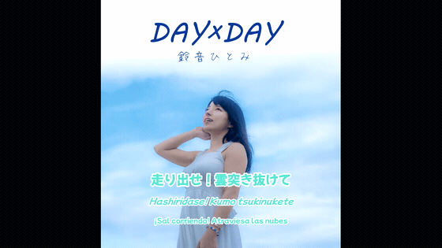

# karaoke-subs

[](examples/01-day-x-day-30s/preview.mp4)

▶ **[Play the full 28s clip with audio](examples/01-day-x-day-30s/preview.mp4)** — a sample from «DAY×DAY» by 鈴音ひとみ (used with the artist's permission). Source files in [`examples/01-day-x-day-30s/`](examples/01-day-x-day-30s/).

Toolkit for generating **trilingual karaoke** videos (Japanese + romaji + translation)
from an audio album and its official lyrics. It synchronizes the timing automatically
by isolating the vocals with [demucs](https://github.com/adefossez/demucs) and
transcribing them with [Whisper](https://github.com/openai/whisper), then maps those
times onto your official text and renders a `.webm` with `.ass` subtitles.

> Designed for a Japanese→romaji→Spanish flow, but the styles and the translation
> language are configurable.

## Why this approach

Classic *forced alignment* derails on songs with repeated choruses and "consumes" text
in the instrumental interludes. Instead:

1. **Isolate the vocals** (demucs) → the interludes become real silence.
2. **Free transcription** of the clean vocals (Whisper large-v3 + word timestamps):
   Whisper picks text **and** time in a coherent way, without derailing on repetitions.
3. **Map** those times onto your official text by aligning both character sequences with
   `difflib`. Since both go in chronological order, the repeated phrases are matched
   by position.

Full details in [`docs/synchronization.md`](docs/synchronization.md).

## Requirements

- **Python 3.9+**, **ffmpeg/ffprobe**
- A venv with `openai-whisper` + `stable-ts` + `demucs` (pipx recommended):
  ```bash
  pipx install openai-whisper
  pipx inject openai-whisper stable-ts demucs
  ```
- Whisper's `large-v3` model in `~/.cache/whisper/` (downloads itself on first use).
- A CJK font installed for the render (the styles use `Noto Sans CJK JP`).

## Configuration (environment variables)

| Variable | Required | Description |
|---|---|---|
| `MUSIC_DIR` | yes | Folder with the source audio files, named `<NN>.*.flac` (e.g. `01.song.flac`). |
| `WHISPER_PYTHON` | recommended | The venv's Python with whisper/stable-ts/demucs. Default `python3`. |
| `KARAOKE_ARTIST` | recommended | Artist name for the title and the outro credits. |
| `COVER_IMAGE` | no | Video background image. Default `_shared/cover.jpg`. |
| `WHISPER_MODEL` | no | Model for `whisper-batch.sh`. Default `medium`. |
| `WHISPER_LANG` | no | Language. Default `ja`. |

```bash
export MUSIC_DIR="/path/to/album"
export WHISPER_PYTHON=~/.local/share/pipx/venvs/openai-whisper/bin/python
export KARAOKE_ARTIST="My Artist"
export COVER_IMAGE="$PWD/_shared/cover.jpg"
```

## Working structure

One folder per track, named `<NN>-<slug>` (e.g. `01-my-song`). Inside:

```
01-my-song/
  lyrics-final.md        # your trilingual lyrics (source, see format below)
  lyrics.ass             # generated: Kanji only (sync input)
  lyrics-fullbackup.ass  # generated: trilingual (merge source)
  lyrics-timed.ass       # generated: Kanji with synced timing
  lyrics-final.ass       # generated: trilingual + outro, ready to render
  01-my-song-karaoke.webm
```

### `lyrics-final.md` format

Sections with `## [name]` and, inside, one block per sung line:

````markdown
## [Verse 1]

```
JP:  情報混線社会
RO:  Jouhou konsen shakai
ES:  Sociedad de información saturada
```
````

## Usage flow

```bash
# 1. Generate the placeholder .ass files from lyrics-final.md
python gen-ass.py 01-my-song "Song title" 01 211   # 211 = duration in sec

# 2. Sync the timing via isolated vocals (demucs + whisper)
./auto-sync.sh 01-my-song

# 3. (optional) Fine-tune by hand in Aegisub on lyrics-timed.ass

# 4. Trilingual merge + outro + webm render
./rebuild.sh 01-my-song

# 5. (optional) Cut a teaser for social media
./make-short.sh 01-my-song 00:00:58 30 chorus
```

`whisper-batch.sh` transcribes all the present tracks in batch (optional prior step).

## Scripts

| Script | Function |
|---|---|
| `gen-ass.py` | Generates `lyrics.ass` (Kanji) and `lyrics-fullbackup.ass` (trilingual) from `lyrics-final.md`. |
| `isolate-vocals.py` | Isolates the vocals of an audio file with demucs. |
| `sync-from-vocals.py` | Transcribes the isolated vocals and maps the times onto the official text. |
| `auto-sync.sh` | Orchestrates vocal isolation + sync (does not render). |
| `whisper-to-ass.py` / `whisper-to-ass-v2.py` | Converts a Whisper JSON to a timed `.ass`. |
| `align-lyrics.py` | Forced alignment (secondary use, see docs). |
| `close-gaps.py` | Closes micro handoff-gaps between lines. |
| `fix-ends.py` / `sync-times.py` | Time adjustments. |
| `merge-trilingual.py` | Merges the Kanji timing with the romaji/translation layers. |
| `outro-credits.py` | Inserts title + artist in the final gap. |
| `rebuild.sh` | Merge + outro + `.webm` render. |
| `ass-to-srt.py` | Exports one layer of the `.ass` to `.srt`. |
| `make-short.sh` | Cuts an MP4 clip for social media. |

## Example

In [`examples/01-day-x-day-30s/`](examples/01-day-x-day-30s/) there is a real 28s sample
from the song «DAY×DAY» by 鈴音ひとみ (published with the artist's permission): the
resulting `preview.mp4`, the source `clip.flac`, the trilingual lyrics and the synced
`.ass`. It's useful for seeing the input format and the result at a glance.

## Documentation

- [`docs/synchronization.md`](docs/synchronization.md) — the synchronization method in detail.
- [`docs/extracting-vocals-without-lyrics.md`](docs/extracting-vocals-without-lyrics.md) — recovering spoken parts/backing vocals that are not in the official lyrics.

## License

MIT — see [`LICENSE`](LICENSE). The toolkit is original code; the audio, the lyrics and
the cover art you process with it belong to their respective rights holders.
